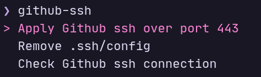

<h1 align="center">Github SSH port fixer script</h1>

<p align="center">a script to help ssh github when it failed.</p>

#### Case

This error happen on Campus/Private network:

```
ssh: connect to host github.com port 22: No route to host
```

#### Prerequisites

- [gum](https://www.github.com/charmbracelet/gum) by charmbracelet

#### How to use

- Run this script.
- Choose one of the options.


